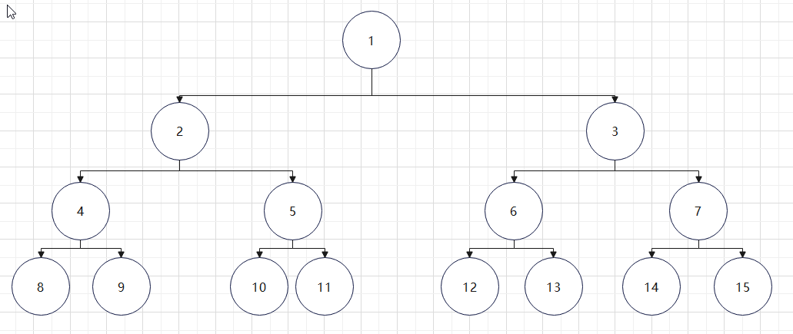
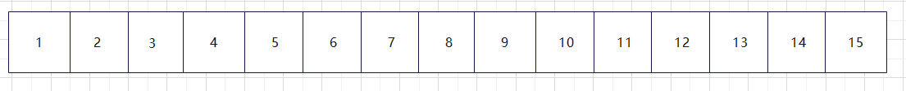
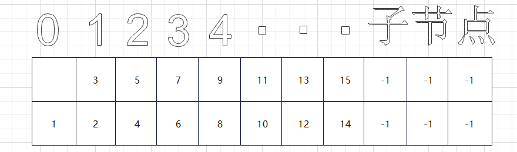

# 树（author: @小麟)
## 目录
* <a href="#1">树的存储</a>
* <a href="#2">树的遍历</a>
* <a href="#3">二叉树</a>
## <a id="1">树的存储</a>
### 顺序储存
按照层序遍历存储到数组中


如果数组从下标1开始存储，则有nums[i]的子节点为$nums[2*i]$,$nums[2*i+1]$，相反nums[i]的父节点为$nums[i/2]$
缺点是如果有些节点没有左子节点或者右子节点这样会造成空间浪费
### 二维数组存储

### 链式存储


## <a id="2">树的遍历建树</a>
### 根据层序遍历建树
```cpp
struct node{
	int value;
	node * l;
	node * r;
	node(int value=' ',node * l = NULL,node * r=NULL):
            value(value),l(l),r(r) {}
};
```
```cpp
void buildtree(int &t){
    int m = 1;
    while(!q.empty()){ 
        q.front()->value = nums[t];
        //cout << q.front()->value << "\n";
        t = t + 1;
        if(m < n){
            q.front()->l = new node();
            q.front()->r = new node();
            q.push(q.front()->l);
            q.push(q.front()->r);
            m = m + 2;
        }
        q.pop();
    }
}
```
### 前序遍历
```cpp
void Precedence(node * root){
    if(root!=NULL){
        printf("%d ",root->value);
		Precedence(root->l);
		Precedence(root->r);
	}
}
```
### 中序遍历
```cpp
void MiddleOrder(node * root){
    if(root!=NULL){
		MiddleOrder(root->l);
        printf("%d ",root->value);
		MiddleOrder(root->r);
	}
}
```
### 后序遍历
```cpp
void PostOrder(node * root){
    if(root!=NULL){
		PostOrder(root->l);      
		PostOrder(root->r);
		printf("%d ",root->value);
	}
}
```
### 根据树的中序遍历和前序遍历建树
#### 洛谷题目
##### [USACO3.4] 美国血统 American Heritage

###### 题目描述

农夫约翰非常认真地对待他的奶牛们的血统。然而他不是一个真正优秀的记帐员。他把他的奶牛 们的家谱作成二叉树，并且把二叉树以更线性的“树的中序遍历”和“树的前序遍历”的符号加以记录而 不是用图形的方法。

你的任务是在被给予奶牛家谱的“树中序遍历”和“树前序遍历”的符号后，创建奶牛家谱的“树的 后序遍历”的符号。每一头奶牛的姓名被译为一个唯一的字母。（你可能已经知道你可以在知道树的两 种遍历以后可以经常地重建这棵树。）显然，这里的树不会有多于 26 个的顶点。  这是在样例输入和 样例输出中的树的图形表达方式：


```
　　　　　　　　 C
　　　　　　   /  \
　　　　　　  /　　\
　　　　　　 B　　  G
　　　　　　/ \　　/
　　　　   A   D  H
　　　　　　  / \
　　　　　　 E   F

```

树的中序遍历是按照左子树，根，右子树的顺序访问节点。

树的前序遍历是按照根，左子树，右子树的顺序访问节点。

树的后序遍历是按照左子树，右子树，根的顺序访问节点。

## 输入格式

第一行： 树的中序遍历

第二行： 同样的树的前序遍历

## 输出格式

单独的一行表示该树的后序遍历。

## 样例 #1

### 样例输入 #1

```
ABEDFCHG
CBADEFGH
```

### 样例输出 #1

```
AEFDBHGC
```

## 提示

题目翻译来自NOCOW。

USACO Training Section 3.4
```cpp
#include <iostream>
#include <vector>
#include <stack>
#include <string.h>
#include <stdlib.h>
using namespace std;
const int N = 100;
int k = 0;
char pre[N], in[N], post[N];
struct node{
	char value;
	node * l;
	node * r;
	node(char value=' ',node * l = NULL,node * r=NULL):
            value(value),l(l),r(r) {}
};
void buildtree(int l,int r,int &t,node * &root){
	int flag = -1;
	for(int i=l;i<=r;i++){
		if(pre[t]==in[i]) {
			flag = i;
			break;
		}
	}
	if(flag==-1) return ;
	root = new node(in[flag]);
	t++;
	if(flag>l) buildtree(l,flag-1,t,root->l);
	if(flag<r) buildtree(flag+1,r,t,root->r);
}
void postbuild(node * root){
	if(root!=NULL){
		postbuild(root->l);
		postbuild(root->r);
		printf("%c",root->value);
		post[k++] = root->value;
	}
}
int main(){
	string s;
	cin >> s;
	node * root;
	int t = 1;
	for(int i=0;i<s.length();i++){
		in[i+1] = s[i];
	}
	cin >> s;
	for(int i=0;i<s.length();i++){
		pre[i+1] = s[i];
	}
	buildtree(1,s.length(),t,root);
	k = 1;
	postbuild(root);
	/*
	for(int i=1;i<=s.length();i++) {
		cout << post[i];
	}
	*/
	return 0;
} 
```
###### 样例分析
```
　　　　　　　　 C
　　　　　　   /  \
　　　　　　  /　　\
　　　　　　 B　　  G
　　　　　　/ \　　/
　　　　   A   D  H
　　　　　　  / \
　　　　　　 E   F

```
前序遍历是 先自己 再坐 再右
第一个节点是C （C）,然后向左走到B,还是先自己（CB）,再左到A（CBA）,A没有左，就往右，右也没有，回退到B，B已经走过左了，往右（CBAD），D往左（CBADE），往右（CBADEF），EF无左右节点，回退到D，B都已经走完了左中右，继续回退C，C往右G，（CBADEFGH）

中序遍历是 先左 再自己 再右
第一个节点是C但是不先自己，往左到B还是不先自己，往左到A，A左边没有，再自己（A），A右边也没有，回退到B，B走完左了，该自己了，（AB），B走完自己了，往右D，D不先自己，往左E（ABE），D走完左，该自己了（ABED）然后往右（ABEDF），然后回退到C，C走完左了，该自己了（ABEDFC），往右（ABEDFCHG）

后序遍历是 先左后右在自己
第一个节点是C往左到B再往左到A，（A），回退到B，不自己，往右D，不自己，往左E（AE），往右（AEF），在自己（AEFD），再回退B，B左右走完了（AEFDB），回退到C，往右G，G往左H （AEFDBHGC）

```
中序 ABEDFCHG
前序 CBADEFGH
```
根据中序和前序建树
中序遍历中，比如对于C则（ABEDF）都在他左下方，（HG）在他右下方
前序第一个为C则（ABEDF）为左子树，（HG）为右子树，
对（ABEDF）和 （HG）递归建树，前序第二个是B，再（ABEDF）中找到，再（HG）中未找到，在左子树中，则（A）和（EDF）为B的左右子树，而B为C的左子节点，同理，前序中G在H前面，G为C的右子节点

代码见 part5 > part5.cpp
## <a id="3">二叉树</a>
#### 二叉排序树
```cpp
struct node {
    int _data;
    int quan;
    int ltreesize;
    node * lnext;
    node * rnext;
    node(int _data = 0,int quan = 0, \
    int ltreesize = 0, node * lnext = nullptr,node * rnext = nullptr):
        _data(_data),
        quan(quan),
        ltreesize(ltreesize),
        lnext(lnext),
        rnext(rnext)
    {

    }

};
```
```cpp 
int quan 是当前的_data有多少个数,int ltreesize 当前节点左子树大小
```
###### 使用插入方法建树，直接按照数组顺序插入
```cpp
void BuildTree(node * root){
    for(int i=0;i<N;i++){
        Insert(root, nums[i]);
    }
}
```
```cpp
void Insert(node * root, int value){
    if(root->quan == 0) {
        root->_data = value;
        root->quan ++;
        return ;
    } 
    if(value > root->_data){
        
        if(root->rnext == nullptr) root->rnext = new node();
        Insert(root->rnext, value);
    }
    else if(value < root->_data){
        root->ltreesize ++;
        if(root->lnext == nullptr) root->lnext = new node();
        Insert(root->lnext, value);
    }
    else {
        root->quan ++;
    }
}
```
###### 按值查找 & 按下标查找
```cpp
int Find_Byvalue(node * root, int value){
    if(root == nullptr) return -1;
    if(root->_data == value) return root->ltreesize + 1;
    else if(value > root->_data) return Find_Byvalue\
        (root->rnext, value) + root->ltreesize + root->quan;
    else return  Find_Byvalue(root->lnext,value);
}
```
```cpp
int FindByindex(node * now , node * root, int index){
    int temp = Find_Byvalue(root, now->_data);
    if(index == temp) return now->_data;
    else if(index > temp){
        return FindByindex(now->rnext, root, index);
    }
    else return FindByindex(now->lnext, root, index);
}
```
```
代码见 code > part5 > part5.1.cpp
```
#### 平衡二叉树

## <font color=pink>来张二次元</font>

<iframe frameborder="no" border="0" marginwidth="0" marginheight="0" width=100% height=86 src="https://music.163.com/outchain/player?type=2&id=1997650590&auto=0&height=66"></iframe>


